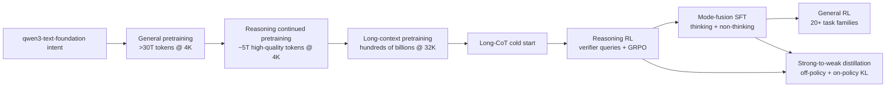
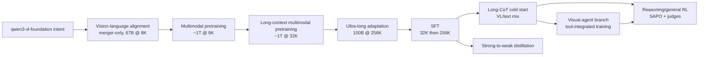

# Qwen3 / Qwen3-VL Kilvin Extension

Kilvin currently teaches the smallest useful control-plane slice: one
production-shaped request becomes one inspectable pretraining stage. A Qwen3-style
or Qwen3-VL-style foundation-model program is much larger, but it does not need a
different mental model. It needs the same durable Temporal/Kilvin foundation
repeated across a richer stage graph.

This is the most literal version of the repo's theme: **shaping the foundation
model**. Kilvin is named after the master artificer from *The Name of the Wind*,
and the metaphor works because these recipes are craft problems as much as
compute problems. Kvothe's line, "It's the questions we can't answer that teach
us the most" (*The Name of the Wind*), fits the training recipe too: the unknowns
become useful only when Kilvin turns them into inspectable constraints. A
foundation block of model weights is shaped by data mixtures, context windows,
verifiers, distillation teachers, reward configs, and operator control.

Important caveat: the Qwen3 and Qwen3-VL reports disclose curriculum shape,
stage budgets, domains, filtering logic, and some mixture ratios. They do not
disclose exact source-level sampler weights, full training hyperparameters,
dedup thresholds, optimizer schedules, or every production system detail. This
guide shows how Kilvin could materialize and operate the disclosed recipe shape;
it does not claim to reproduce the exact Qwen training run.

## The Kilvin Foundation

The current `qwen3-text-foundation` or `qwen3-vl-foundation` extension would
still start from Kilvin's existing primitives:

| Kilvin primitive | Qwen-scale role |
| --- | --- |
| `StageConfig` | One curriculum step with stage id, phase, dependency edges, data requirements, runtime profile, and retry policy. |
| `interpret_training_intent` | Expands a high-level model request into a concrete recipe manifest and ordered stage graph. |
| dependency concretization | Builds and pins trainer code, CUDA/Torch/NCCL stack, tokenizer, vision encoder assets, reward/verifier code, and data tools. |
| quota/allocation | Reserves GPUs, host memory, storage locality, verifier capacity, rollout workers, or teacher-inference capacity per stage. |
| `materialize_training_bundle` | Writes the exact launch spec: image digest, checkpoints, context window, sampler snapshot, reward config, and environment. |
| `submit_k8s_job` | Submits each stage as a concrete training, distillation, rollout, verifier, or evaluation job. |
| `monitor_training` | Heartbeats progress, loss, tokens, pass rate, verifier health, rollout entropy, checkpoint status, and artifact pointers. |
| signals | Pause, resume, cancel, hotfix a bad stage, or request targeted operator review. |
| queries | Read the current stage, checkpoint, data mix, quota reservation, reward config, and monitor status without mutating the run. |
| replay | Reconstruct workflow decisions from history without rebuilding completed images or resubmitting completed jobs. |

The key extension is not "make Kilvin complicated." It is "let one workflow own a
larger recipe manifest while every stage keeps the same durable, inspectable
side-effect boundaries."

## Qwen3 Text Curriculum

The Qwen3-style text recipe is a capability curriculum: broad knowledge first,
then reasoning-heavy continued pretraining, then long context, then post-training
that separates verifiable reasoning, mode control, general alignment, and
student distillation.

| Stage | What Kilvin would materialize |
| --- | --- |
| General pretraining | Broad multilingual corpus manifest, tokenizer assets, base model config, large GPU placement, and long-running token/loss monitoring. |
| Reasoning continued pretraining | STEM/code/reasoning data buckets, synthetic-data provenance, faster decay schedule metadata, and checkpoint lineage from general pretrain. |
| Long-context pretraining | Context window change, long-document sampler snapshot, RoPE/YARN/Dual Chunk Attention settings, and context-length evaluation probes. |
| Long-CoT cold start | Verifiable CoT SFT dataset, answer-checking rules, contamination filters, and short-run guardrails so SFT does not over-constrain later RL. |
| Reasoning RL | Verifier set, rollout worker pool, GRPO reward config, entropy monitoring, pass-rate dashboards, and failure artifacts for invalid verifier cases. |
| Mode-fusion SFT | Thinking/non-thinking mixture manifest, `/think` and `/no_think` format contract, low-resource translation bump, and mode-specific evaluations. |
| General RL | Rule rewards, model-judge rewards, reference/no-reference reward configs, agent/RAG/task-family monitors, and trade-off dashboards. |
| Strong-to-weak distillation | Teacher checkpoint, off-policy response data, on-policy student samples, teacher-logit/KL config, and GPU-hour accounting for student models. |

For Temporal, each row is a stage or substage that can be retried, paused,
queried, or replayed at the workflow level while its side effects remain
activity-owned.

## Qwen3-VL Multimodal Curriculum

The Qwen3-VL-style recipe starts from a Qwen3 text backbone and adds vision,
documents, grounding, video, multimodal code, GUI/agent data, and tool-integrated
visual reasoning. This is where Kilvin's artifact discipline matters most:
multimodal data errors are hard to debug unless every sampler, parser, merger,
and reward config is materialized.

| Stage | What Kilvin would materialize |
| --- | --- |
| Vision-language alignment | Frozen vision encoder, frozen LLM backbone, trainable merger scope, image-caption/OCR manifest, and alignment loss monitor. |
| Multimodal pretraining | Interleaved image-text, OCR, document parsing, grounding, STEM, code, video, and text-only data buckets plus modality balance checks. |
| Long-context multimodal pretraining | 32K context settings, video/document sampler snapshot, more text-only preservation data, and long-form evaluation probes. |
| Ultra-long adaptation | 256K context window, long-video and long-document shard manifests, page/image ratio filters, and memory/throughput monitors. |
| SFT | 32K then 256K SFT plan, sample mix around one-third text-only and two-thirds image/video-text, response filters, and visual-grounding judges. |
| Long-CoT cold start | Vision-language/text-only reasoning mix, multimodal necessity filters, difficulty curation, and bad-answer/repetition/language filters. |
| Strong-to-weak distillation | Teacher outputs, student on-policy samples, teacher logits, text-backbone distillation settings, and multimodal regression checks. |
| Reasoning/general RL | SAPO or stage-specific RL config, verifier queries, model judges, pass-rate filters, VQA/OCR/document/grounding rewards, and failure-mode monitors. |
| Visual-agent branch | Tool-call schema, grounding examples, multi-turn visual-agent trajectories, expected tool-call rewards, and tool execution logs. |

## Recipe Manifest Shape

The future docs and manifests should describe recipes as data before running
jobs. A minimal recipe manifest would contain:

- stage id and dependency edges;
- modality: text, image-text, video-text, document, GUI, tool, or mixed;
- context window and any extension settings;
- token/sample budget plus budget tolerance;
- data buckets, filtering notes, and quality thresholds;
- verifier requirements for RL or cold-start filtering;
- trainable parameter scope such as all parameters, merger-only, backbone-only,
  adapters, reward model, or student;
- monitoring goals such as tokens, samples, loss, pass rate, entropy, judge
  score, checkpoint health, data-loader throughput, and modality balance.

Existing Kilvin artifacts would generalize into per-stage evidence:

| Artifact | Purpose |
| --- | --- |
| `mixture_manifest.yaml` | Declares the stage's disclosed data buckets, ratios when known, and qualitative mixture intent. |
| `sampler_snapshot.yaml` | Pins the concrete sampler version, shard set, filters, dedup pass, and random seed for this run. |
| `verifier_set.yaml` | Lists rule/code/model verifiers, held-out checks, and contamination constraints. |
| `reward_config.yaml` | Records GRPO/SAPO/general-RL reward sources, judge model refs, references, and weighting. |
| `distillation_teacher.yaml` | Pins teacher checkpoint, logits source, off-policy data, on-policy sampling policy, and KL settings. |
| `modality_manifest.yaml` | Records text/image/video/document/GUI/tool proportions and modality-specific preprocessing. |

These artifacts are the bridge from a paper recipe to an operable training
platform. They make questions answerable after the fact: which corpus did this
stage use, which verifier judged it, which context window launched, which
checkpoint became the teacher, and what exactly changed when an operator
hotfixed a stage?

## Why Temporal Matters More At This Scale

Qwen-scale training is not one long script. It is a curriculum where every stage
depends on previous checkpoints, data gates, resource reservations, evaluators,
and operator decisions. Temporal is useful because the workflow history can own
the recipe decisions while activities own fragile side effects:

- dependency builds can retry without changing accepted recipe intent;
- quota/allocation can wait for scarce GPU or teacher-inference capacity while
  preserving the stage graph;
- materialized launch specs prevent silent drift between intended context window,
  sampler, reward config, and submitted job;
- monitoring can heartbeat long training, rollout, and verifier work across
  worker restarts;
- signals can pause a bad data mix, resume after an operator review, cancel a
  stage, or request targeted replay;
- queries can expose the current curriculum, checkpoint lineage, artifacts, and
  risk state to a UI or operator script.

Kilvin should remain small in this repo. The teaching extension shows how its
foundation scales: keep the current laptop proof as the executable core, then
use Qwen3-style and Qwen3-VL-style recipes to teach what a real foundation-model
training platform must materialize, inspect, and control.
